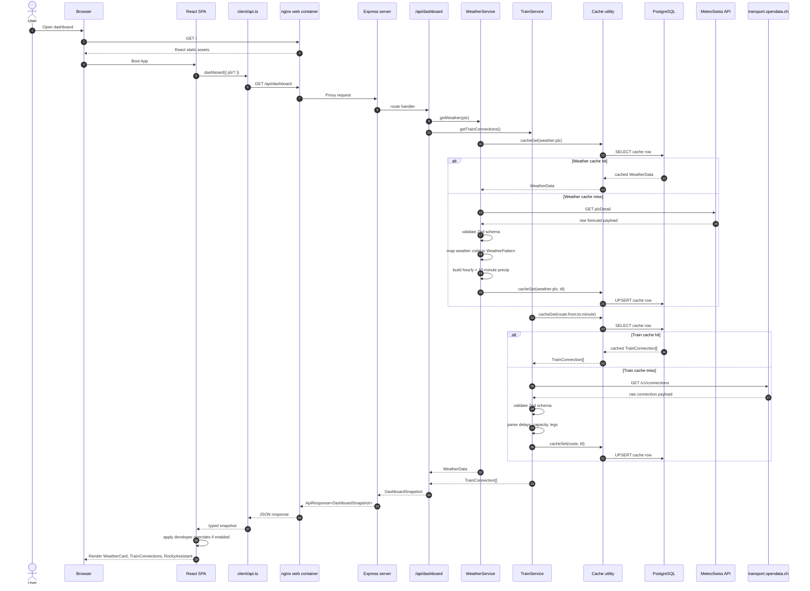
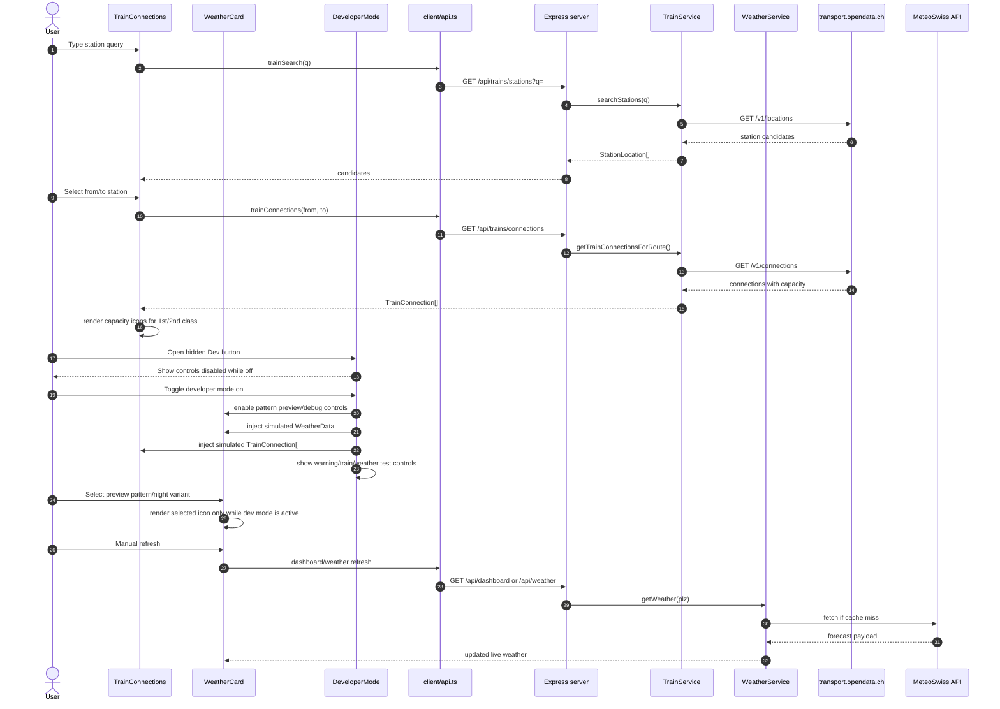

# Home Dashboard

A personal, self-hosted dashboard designed to show everything relevant for starting your day — current weather, live train departures, and an AI-powered weather commentary from Rocky the alien. Runs entirely on your machine with a single command and requires no API keys or account sign-ups.

---

## Management Summary

Home Dashboard is a compact web application that aggregates real-time data from two free public APIs and presents it as a clean, dark-themed dashboard in your browser.

**What it shows**

- **Weather** — current conditions (temperature, wind, humidity, UV, visibility) and a 7-day outlook sourced from MeteoSwiss. Location is searchable by Swiss city name or postcode.
- **Train connections** — the next 15 departures between two configurable Swiss stations, with real-time delay information from the SBB/opendata.ch feed.
- **Rocky the Assistant** — a weather commentary panel featuring Rocky, the alien from *Project Hail Mary* by Andy Weir. Rocky delivers dry, alien observations about the current conditions in his characteristically terse style, cycling through a fresh set of remarks every 10 seconds.
- **Training log** — a static weekly training plan and KPI summary page.

**No external accounts required.** MeteoSwiss and transport.opendata.ch are open APIs; no keys or credentials are needed.

---

## Architecture

```
Browser
  └─► web  (nginx, port 8080)
        ├── serves the React SPA (static files)
        └── /api  ──► server  (Node/Express, port 3001)
                         ├── /api/weather    → MeteoSwiss app API
                         ├── /api/dashboard  → weather + trains combined
                         ├── /api/rocky      → weather-contextual Rocky messages
                         └── /api/health     → status check
                                │
                               db  (PostgreSQL 16, internal only)
                                    └── response cache (weather + trains)
```

The stack is three Docker containers on a private bridge network. Only `web` is reachable from your host machine. The database is used solely as a response cache so that upstream APIs are not hammered on every page load; it never stores personal data.

### Detailed UML Architecture

The diagrams below use Mermaid's UML-style notation and mirror the current codebase structure.

#### Component Diagram

```mermaid
classDiagram
direction LR

class Browser {
  <<external client>>
  +open http://localhost:8080
  +render SPA
}

class WebContainer {
  <<Docker container: web>>
  +nginx
  +serve static React bundle
  +proxy /api/* to server:3001
}

class ClientApp {
  <<React/Vite SPA>>
  +App()
  +LangContext
  +tab navigation
  +developer mode overlay
  +localStorage selected PLZ
}

class ApiClient {
  <<client/src/api.ts>>
  +dashboard(opts)
  +weatherSearch(q)
  +trainSearch(q)
  +trainConnections(from, to)
  +rocky(plz)
  +health()
}

class UseDashboard {
  <<hook>>
  +poll every 60s
  +refresh()
  +status
  +lastUpdated
}

class WeatherCard {
  <<component>>
  +current weather pattern icon
  +10-minute precipitation bars
  +24-hour forecast
  +7-day forecast
  +location search
  +developer diagnostics
}

class WeatherPatternIcon {
  <<component>>
  +WeatherPattern enum rendering
  +day/night variants
  +fallback icon
  +animated current icon
}

class TrainConnections {
  <<component>>
  +station typeahead
  +favourites
  +connection list
  +capacity indicators
  +custom route refresh
}

class RockyAssistant {
  <<component>>
  +poll /api/rocky
  +cycle messages
  +dev message override
}

class DeveloperMode {
  <<component>>
  +weather pattern preview
  +temperature/wind/rain controls
  +train scenarios
  +warning simulation
  +disabled unless active
}

class TrainingPage {
  <<components>>
  +WeeklyTrainingPlan
  +TrainingKPIs
}

class ServerContainer {
  <<Docker container: server>>
  +Node 20
  +Express app
  +Prisma client
  +graceful shutdown
}

class ExpressApp {
  <<server/src/index.ts>>
  +applySecurity()
  +requestLogger
  +apiLimiter
  +mount routers
  +errorHandler
}

class DashboardRouter {
  <<route /api/dashboard>>
  +GET /?plz
  +Promise.allSettled(weather, trains)
  +return DashboardSnapshot
}

class WeatherRouter {
  <<route /api/weather>>
  +GET /
  +GET /search
  +validate PLZ/search query
}

class TrainsRouter {
  <<route /api/trains>>
  +GET /stations
  +GET /connections
  +validate station names
}

class RockyRouter {
  <<route /api/rocky>>
  +GET /?plz
  +weather contextual messages
}

class HealthRouter {
  <<route /api/health>>
  +GET /
  +integration status
}

class DevRouter {
  <<route /api/dev>>
  +GET /logs
  +GET /logs/stream
  +POST /logs/clear
  +404 unless DEVELOPER_MODE=true
}

class WeatherService {
  <<service>>
  +getWeather(plz)
  +searchLocations(query)
  +map MeteoSwiss code to WeatherPattern
  +build hourly forecast
  +build 10-minute precipitation
  +cache forecast/search
}

class TrainService {
  <<service>>
  +getTrainConnections()
  +getTrainConnectionsForRoute(from, to)
  +searchStations(query)
  +parse capacity1st/capacity2nd
  +cache by route/minute
}

class RockyService {
  <<service>>
  +generateRockyMessages(weather)
  +derive tone from weather
}

class HttpClient {
  <<utility>>
  +SSRF allowlist
  +timeout handling
  +redacted logging
}

class Cache {
  <<utility>>
  +cacheGet(key)
  +cacheSet(key, value, ttl)
  +cachePurgeExpired()
}

class Logger {
  <<utility>>
  +redact secrets
  +in-memory log ring
  +EventEmitter for SSE
}

class Env {
  <<config>>
  +load .env
  +validate with Zod
  +production guardrails
}

class SharedPackage {
  <<npm workspace>>
  +ApiResponse<T>
  +DashboardSnapshot
  +WeatherData
  +WeatherPattern
  +TrainConnection
  +DevLog
}

class Postgres {
  <<Docker container: db>>
  +PostgreSQL 16
  +cache table
  +internal network only
}

class Prisma {
  <<ORM>>
  +PrismaClient singleton
  +schema push at container start
}

class MeteoSwissAPI {
  <<external API>>
  +plzDetail forecast
  +location search
}

class TransportOpenDataAPI {
  <<external API>>
  +connections
  +locations
}

Browser --> WebContainer : HTTP :8080
WebContainer --> ClientApp : static assets
ClientApp --> ApiClient : calls
ClientApp --> UseDashboard : uses
ClientApp --> WeatherCard : renders
ClientApp --> TrainConnections : renders
ClientApp --> RockyAssistant : renders
ClientApp --> DeveloperMode : renders
ClientApp --> TrainingPage : renders
WeatherCard --> WeatherPatternIcon : renders
UseDashboard --> ApiClient : refresh dashboard
WebContainer --> ServerContainer : proxy /api/*
ServerContainer --> ExpressApp : boots
ExpressApp --> DashboardRouter : mounts
ExpressApp --> WeatherRouter : mounts
ExpressApp --> TrainsRouter : mounts
ExpressApp --> RockyRouter : mounts
ExpressApp --> HealthRouter : mounts
ExpressApp --> DevRouter : mounts
DashboardRouter --> WeatherService : getWeather()
DashboardRouter --> TrainService : getTrainConnections()
WeatherRouter --> WeatherService : getWeather(), searchLocations()
TrainsRouter --> TrainService : searchStations(), route lookup
RockyRouter --> WeatherService : getWeather()
RockyRouter --> RockyService : generate messages
WeatherService --> HttpClient : MeteoSwiss requests
TrainService --> HttpClient : transport.opendata.ch requests
WeatherService --> Cache : forecast/search cache
TrainService --> Cache : route/station cache
Cache --> Prisma : read/write
Prisma --> Postgres : SQL
Logger --> DevRouter : SSE log stream
HttpClient --> Logger : IN/OUT logs
ExpressApp --> Env : configuration
WeatherService --> MeteoSwissAPI : HTTPS
TrainService --> TransportOpenDataAPI : HTTPS
ClientApp ..> SharedPackage : TypeScript contracts
ServerContainer ..> SharedPackage : TypeScript contracts
```

#### Main Data Flow Sequence



#### Interactive Route And Developer Mode Sequence



**Key technology choices**

| Layer | Stack |
|---|---|
| Frontend | React 18, Vite, Tailwind CSS, TypeScript |
| Backend | Node 20, Express 5, Zod, Helmet, Prisma |
| Database | PostgreSQL 16 (cache only) |
| Container | Docker Compose, multi-stage builds |
| Shared types | `@home-dashboard/shared` (npm workspace) |

---

## Prerequisites

- **Docker Desktop** — [download here](https://www.docker.com/products/docker-desktop/). This is the only requirement; everything else runs inside containers.
- **Git** — to clone the repository.
- **(Optional) Make** — for the convenience `make` shortcuts. Git for Windows ships with it; on macOS it is pre-installed.

---

## Quick Start

```sh
git clone <repo-url> home-dashboard
cd home-dashboard
docker compose up -d --build
```

Open **http://localhost:8080** once the build completes (usually 60–90 seconds on first run).

That is all. No `.env` file needs to be created, no passwords need to be set, and no configuration files need to be edited.

---

## Management Commands

Using `make` (recommended):

| Command | Effect |
|---|---|
| `make` or `make start` | Build images and start all containers |
| `make stop` | Stop containers (data is preserved) |
| `make restart` | Stop, rebuild, and start |
| `make logs` | Tail live logs from all containers |
| `make update` | Pull latest code and rebuild |
| `make clean` | Tear down everything including the database volume |

Using Docker Compose directly:

| Command | Effect |
|---|---|
| `docker compose up -d --build` | Build and start |
| `docker compose down` | Stop |
| `docker compose logs -f` | Live logs |
| `docker compose down -v` | Full reset including database |

---

## Configuration Reference

All settings have built-in defaults. You only need a `.env` file if you want to override them.

| Variable | Default | Description |
|---|---|---|
| `DB_PASSWORD` | `home_dashboard_secret` | PostgreSQL password for the app user |
| `WEATHER_PLZ` | `8400` | 4-digit Swiss postal code for the default weather location |
| `WEATHER_CITY` | `Winterthur` | Display name for the default location |
| `SBB_FROM` | `Winterthur` | Departure station for train connections |
| `SBB_TO` | `Zürich HB` | Destination station |
| `SBB_NUM_CONNECTIONS` | `15` | Number of connections to fetch |
| `WEB_PORT` | `8080` | Host port the dashboard is served on |
| `PUBLIC_URL` | `http://localhost:8080` | Full public URL (used for CORS) |
| `LOG_LEVEL` | `info` | Server log verbosity (`debug`, `info`, `warn`, `error`) |
| `DEVELOPER_MODE` | `false` | Enables the `/api/dev` debugging endpoint |

To override any setting, create a `.env` file in the project root and set only the variables you want to change:

```sh
# .env  (only include what you want to change)
SBB_FROM=Zürich HB
SBB_TO=Bern
WEATHER_PLZ=3000000
WEATHER_CITY=Bern
```

---

## Development Setup

To run the app locally without Docker (for active development):

**Prerequisites:** Node 20+, npm 10+, a running PostgreSQL instance.

```sh
# 1. Install all dependencies (root, client, server, shared)
npm install

# 2. Build the shared types package
npm run build -w packages/shared

# 3. Configure the server
cp server/.env.example server/.env
#    Edit server/.env and set DATABASE_URL to your local Postgres instance

# 4. Push the Prisma schema
cd server && npx prisma db push && cd ..

# 5. Start the server (port 3001) and the Vite dev server (port 5173) in parallel
npm run dev -w server &
npm run dev -w client
```

The Vite dev server proxies `/api` requests to `localhost:3001`, so both run as a unified local stack.

---

## Repository Layout

```
packages/
  shared/src/index.ts       Shared TypeScript types (ApiResponse, WeatherData, …)

server/src/
  config/env.ts             Environment validation (Zod)
  middleware/               Security (Helmet, CORS, rate-limit), logging, errors
  routes/                   health, dashboard, weather, rocky
  services/
    weatherService.ts       MeteoSwiss API integration + caching
    trainService.ts         SBB opendata.ch integration + caching
    rockyService.ts         Weather-to-Rocky-message mapping
  utils/                    Prisma client, HTTP client (SSRF allowlist), logger, cache

client/src/
  components/
    WeatherCard.tsx         Current conditions + location search + 7-day forecast
    TrainConnections.tsx    Live departure board with delay indicators
    RockyAssistant.tsx      Rocky SVG illustration + speech bubble + message cycling
    WeeklyTrainingPlan.tsx  Static training schedule
    TrainingKPIs.tsx        Training metrics display
  hooks/useDashboard.ts     Polling hook for the dashboard snapshot
  api.ts                    Type-safe API client
```

---

## Security Notes

- The web port is bound to `127.0.0.1` — it is not accessible from other machines on your network.
- The database container has no host port binding; it is unreachable from outside the Docker network.
- The server's HTTP client enforces an SSRF allowlist — it will only contact the three known upstream hosts.
- All upstream API responses are validated with Zod schemas before use.
- Request logs redact any fields whose names resemble secrets.
